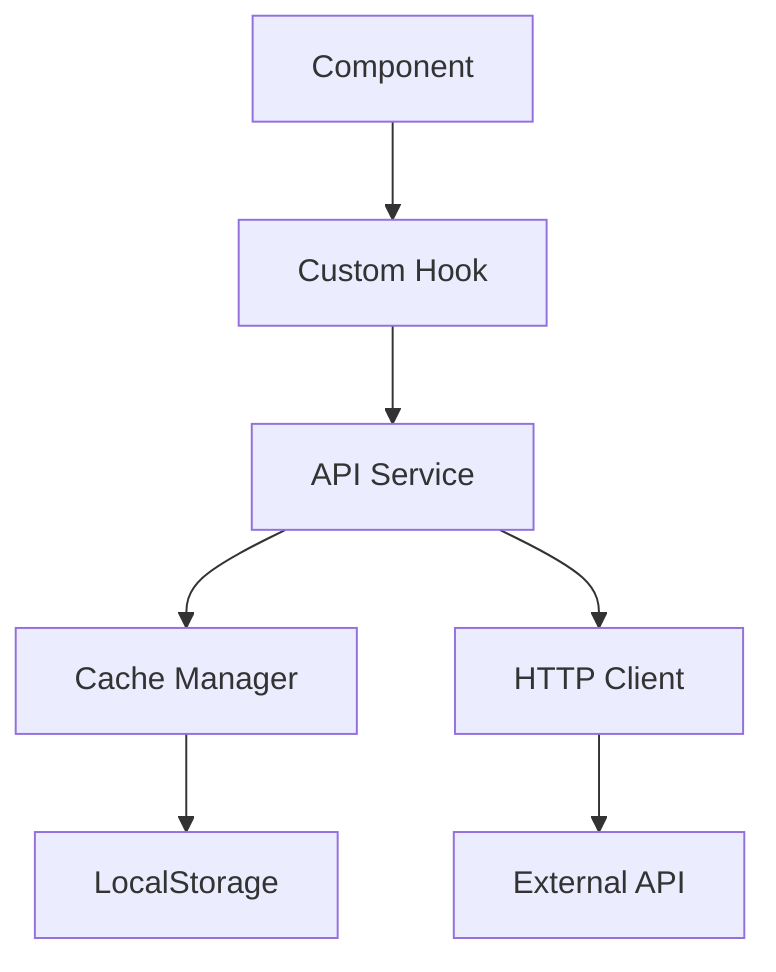

# 🏗️ CyberNews Architecture

## 📁 Project Structure

```
src/
├── app/                    # Next.js App Router
│   ├── layout.tsx         # Root layout
│   ├── page.tsx           # Home page
│   └── [...routes]/       # Dynamic routes
│
├── components/            # React Components
│   ├── common/           # Shared components
│   ├── effects/          # Visual effects & animations
│   ├── features/         # Feature-specific components
│   └── layout/           # Layout components
│
├── services/             # Business Logic & External Services
│   ├── api/             # API clients
│   │   └── HttpClient.ts
│   ├── cache/           # Caching logic
│   │   └── CacheManager.ts
│   ├── types/           # TypeScript definitions
│   │   └── HackerNews.ts
│   └── hackerNewsAPI.ts # Main API service
│
├── hooks/               # Custom React hooks
│   ├── useStories.ts
│   └── useSearch.ts
│
├── styles/             # Global styles
│   └── globals.css
│
└── utils/              # Helper functions
    ├── date.ts
    └── format.ts
```

## 🔄 Data Flow



## 🏛️ Architectural Patterns

### 1. Service Layer Pattern
- Isolates business logic from UI components
- Provides clean API for data operations
- Handles caching and error management

```typescript
// Example usage
const stories = await hackerNewsAPI.getStories('top');
```

### 2. Cache Strategy Pattern
- In-memory cache with localStorage persistence
- TTL (Time-To-Live) based invalidation
- Configurable cache sizes and durations

```typescript
const CACHE_CONFIG = {
  storyTTL: 5 * 60 * 1000,    // 5 minutes
  listingTTL: 2 * 60 * 1000,  // 2 minutes
  maxStories: 500
};
```

### 3. HTTP Client Abstraction
- Centralized HTTP request handling
- Consistent error handling
- Easy to mock for testing

```typescript
const client = new HttpClient(baseURL);
const data = await client.get('/endpoint');
```

## 🔒 Security Considerations

1. **Data Sanitization**
   - All external data is validated
   - XSS prevention in rendered content
   - Safe HTML parsing

2. **Error Handling**
   - Graceful degradation
   - User-friendly error messages
   - Detailed error logging

3. **Rate Limiting**
   - Respects API rate limits
   - Implements request throttling
   - Caching to reduce API calls

## 🎯 Design Principles

### SOLID Principles
1. **Single Responsibility**
   - Each service has one specific purpose
   - Clear separation of concerns

2. **Open/Closed**
   - Services are extensible
   - New features don't modify existing code

3. **Interface Segregation**
   - Small, focused interfaces
   - Modular component design

### Clean Code Practices
1. **DRY (Don't Repeat Yourself)**
   - Reusable components
   - Shared utilities
   - Common patterns

2. **KISS (Keep It Simple, Stupid)**
   - Clear, straightforward implementations
   - Minimal complexity
   - Self-documenting code

## 🔧 Development Guidelines

### Component Structure
```typescript
// Feature components
src/components/features/StoryList/
├── StoryList.tsx
├── StoryItem.tsx
├── StoryList.test.tsx
└── index.ts

// Common components
src/components/common/Button/
├── Button.tsx
├── Button.test.tsx
└── index.ts
```

### Naming Conventions
- **Components**: PascalCase (e.g., `StoryList.tsx`)
- **Hooks**: camelCase with 'use' prefix (e.g., `useStories.ts`)
- **Utils**: camelCase (e.g., `formatDate.ts`)
- **Constants**: UPPER_SNAKE_CASE (e.g., `MAX_ITEMS`)

### Testing Strategy
1. **Unit Tests**
   - Components
   - Hooks
   - Utilities
   - Services

2. **Integration Tests**
   - API interactions
   - Cache operations
   - Component interactions

3. **E2E Tests**
   - User flows
   - Critical paths
   - Mobile responsiveness

## 📱 Mobile-First Approach

### Responsive Design
- Mobile-first CSS
- Adaptive layouts
- Touch-friendly interactions

### Performance
- Lazy loading
- Image optimization
- Bundle size management
- Service worker caching

## 🔄 State Management

### Local State
- React useState
- Component-level state
- Form state

### Cache State
- In-memory cache
- localStorage persistence
- TTL-based invalidation

## 🚀 Performance Optimizations

1. **Caching Strategy**
   - In-memory cache
   - localStorage backup
   - Intelligent invalidation

2. **Code Splitting**
   - Route-based splitting
   - Component lazy loading
   - Dynamic imports

3. **Resource Optimization**
   - Image optimization
   - Font loading strategy
   - CSS optimization

## 📈 Monitoring & Analytics

1. **Performance Metrics**
   - Load times
   - Time to Interactive
   - First Contentful Paint

2. **Error Tracking**
   - Error boundaries
   - Service errors
   - API failures

3. **Usage Analytics**
   - User interactions
   - Popular content
   - Search patterns

## 🔄 Continuous Integration

1. **Pre-commit Hooks**
   - Linting
   - Type checking
   - Unit tests

2. **Build Pipeline**
   - Code quality checks
   - Test automation
   - Build optimization

## 📚 Documentation

1. **Code Documentation**
   - JSDoc comments
   - Type definitions
   - README files

2. **API Documentation**
   - Service interfaces
   - Component props
   - Hook usage

3. **Architecture Documentation**
   - System overview
   - Design decisions
   - Best practices