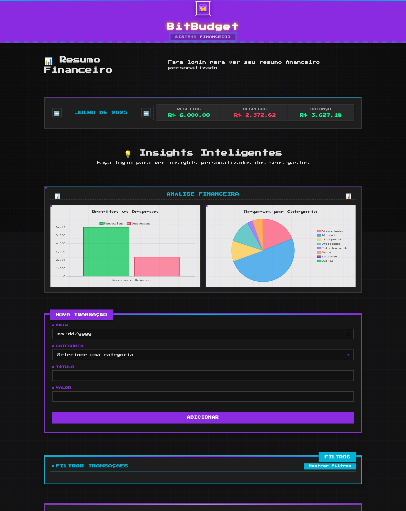
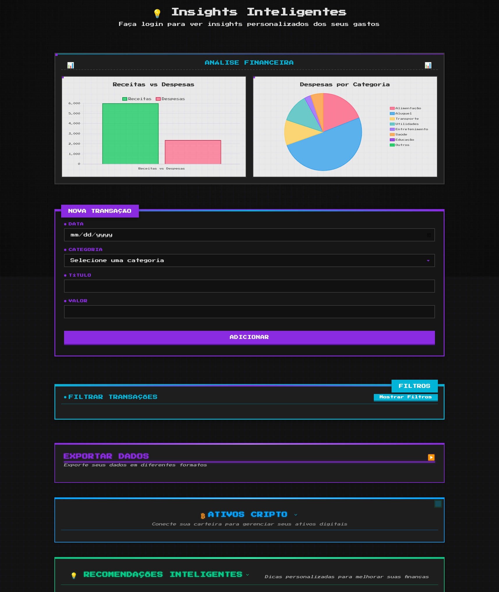
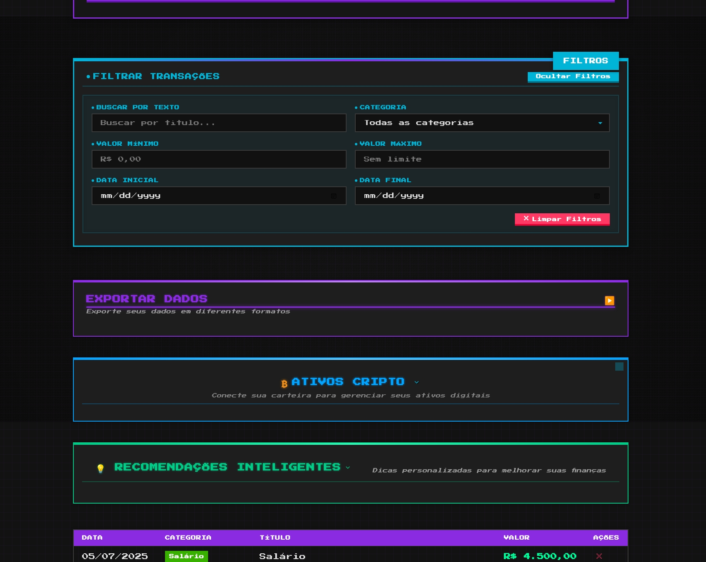
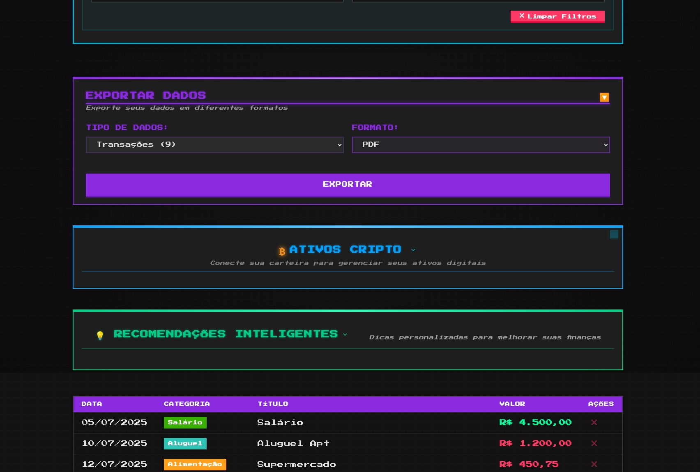
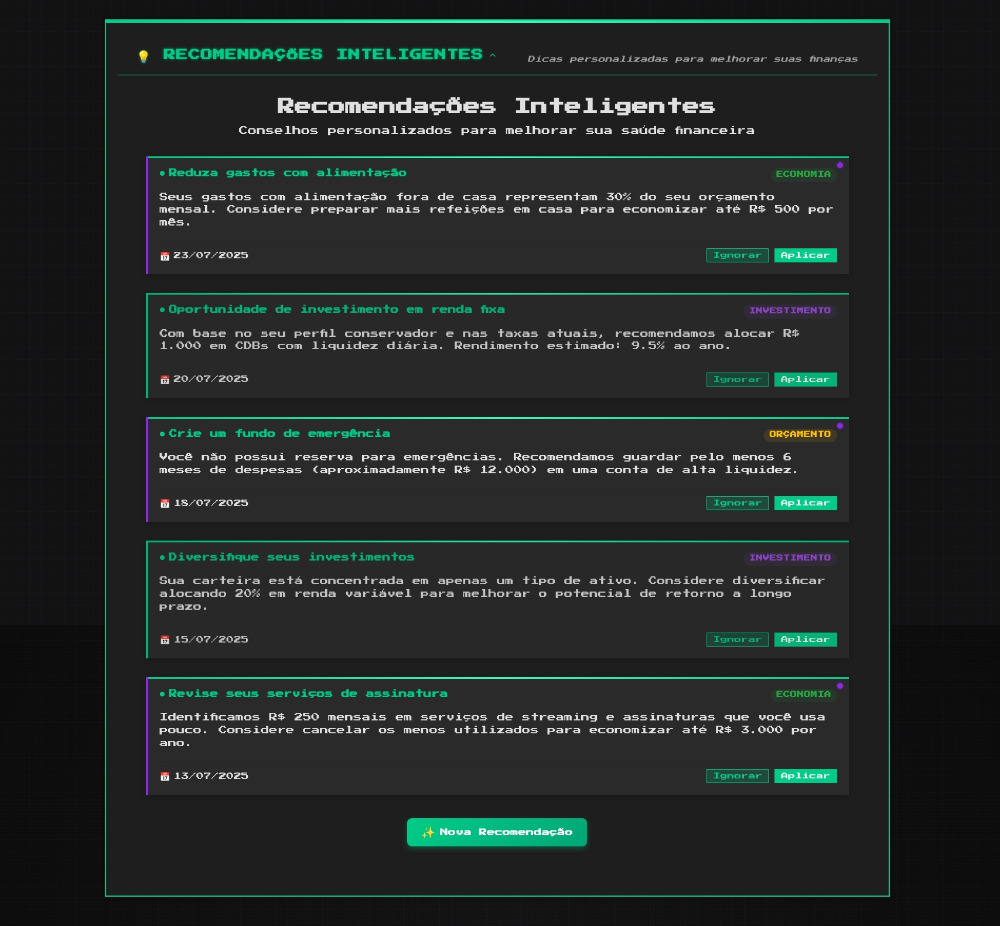
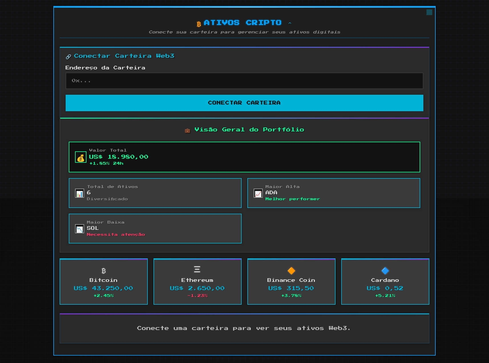
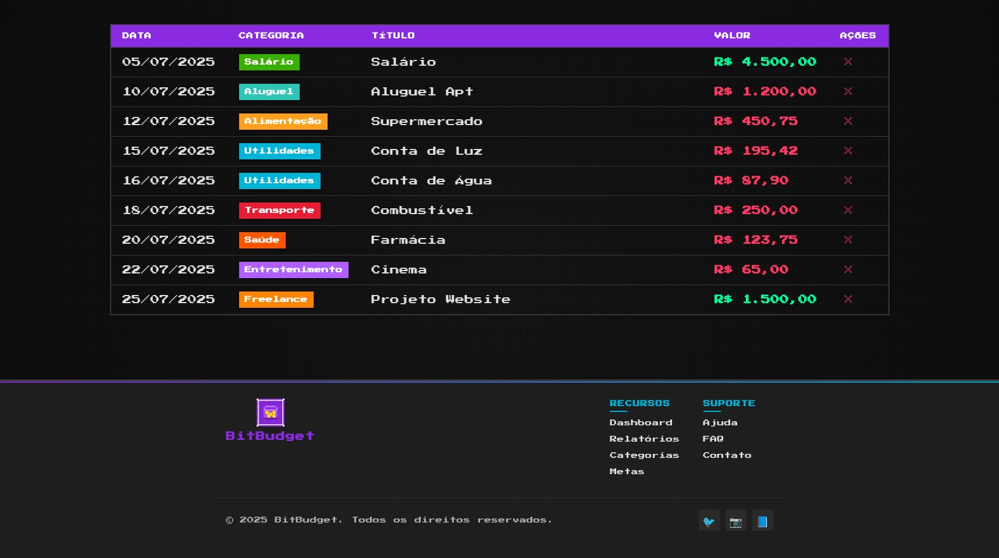

# CyberNews - Cyberpunk Hacker News Client

A retro-futuristic take on Hacker News, built with Next.js and featuring cyberpunk/retrowave aesthetics.

## 🌟 Features

### Core Features
- Article search and pagination
- Real-time article updates
- Offline support
- Responsive design

### Cyberpunk Features
- 🖥️ Terminal-like interface with CRT screen effect
- 🎮 Keyboard-first navigation (vim-style)
- 🎯 "Hacker mode" with pure terminal interface
- 🔊 Voice command support
- 🔒 Article "decryption" animations
- 🌧️ Matrix-style rain effect
- 💾 Retro boot sequence

## 🚀 Quick Start

```bash
# Install dependencies
npm install

# Run development server
npm run dev

# Build for production
npm run build

# Start production server
npm start
```

## 🎮 Controls

### Keyboard Shortcuts
- `/` - Focus search
- `j` - Next article
- `k` - Previous article
- `h` - Previous page
- `l` - Next page
- `ESC` - Clear/Exit
- `Ctrl + H` - Toggle Hacker Mode


### Voice Commands
- "Search [term]"
- "Next page"
- "Previous page"
- "Open article"
- "Save article"

### Visuals











## 🛠️ Tech Stack

- Next.js 13+ (App Router)
- TypeScript
- TailwindCSS
- Framer Motion
- Web Speech API
- IndexedDB
- Service Workers

## 🎨 Theme Customization

The app includes multiple cyberpunk themes:
- Neon Night
- Matrix Green
- Synthwave
- Deep Web
- Terminal Classic

## 🔧 Development

### Prerequisites
- Node.js 18+
- npm/yarn
- Modern browser with Web Speech API support

### Environment Setup
```bash
# Copy environment file
cp .env.example .env.local

# Configure your environment variables
NEXT_PUBLIC_API_URL=your_api_url
```

### Project Structure
```
src/
├── app/          # Next.js App Router
├── components/   # Shared components
├── features/     # Feature modules
├── hooks/        # Custom hooks
├── styles/       # Global styles
└── utils/        # Utility functions
```

## 🤝 Contributing

1. Fork the repository
2. Create your feature branch (`git checkout -b feature/amazing-feature`)
3. Commit your changes (`git commit -m 'Add amazing feature'`)
4. Push to the branch (`git push origin feature/amazing-feature`)
5. Open a Pull Request

## 📝 License

MIT License - see the [LICENSE](LICENSE) file for details

## 🙏 Acknowledgments

- Hacker News API
- Cyberpunk 2077 (inspiration)
- Synthwave/Retrowave community
